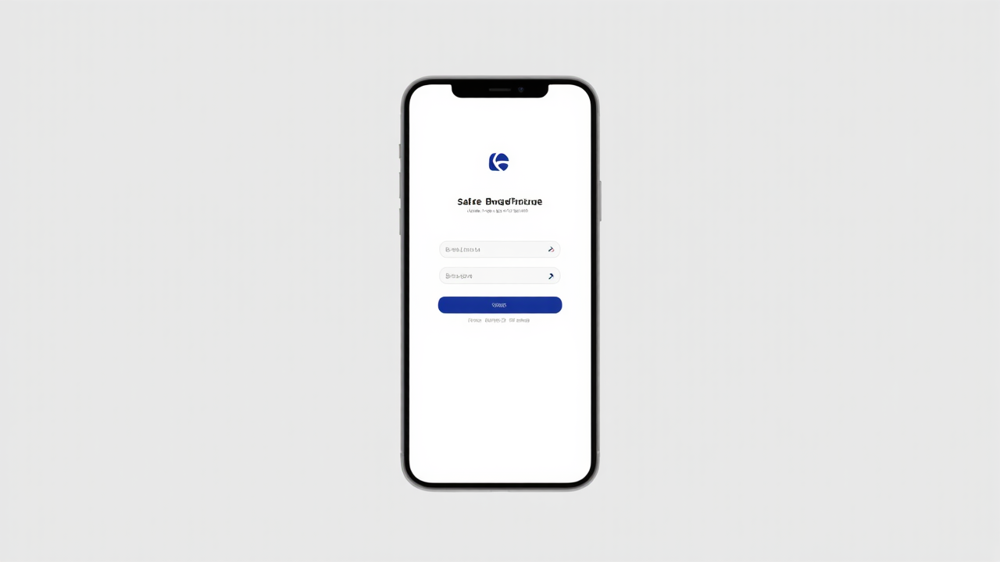
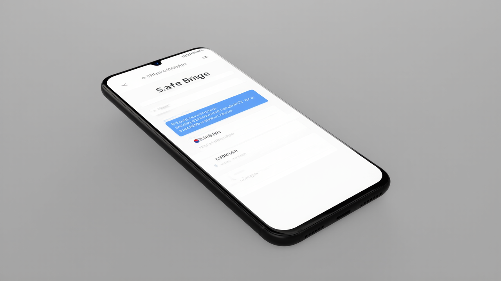
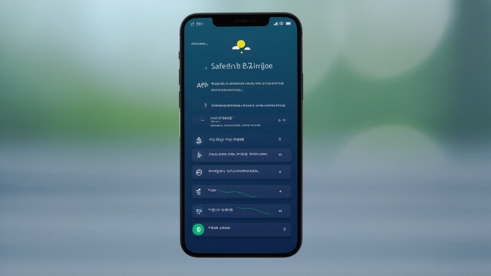
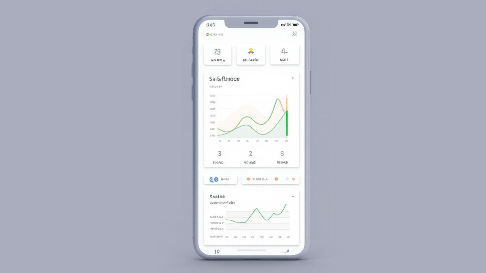
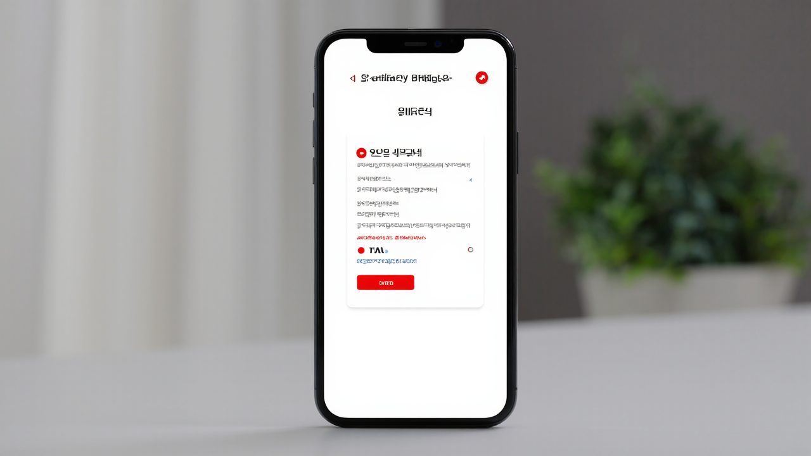

# SafeBridge 🌉
### 다국어 재난안전 통합 플랫폼

외국인 노동자와 고용주 간의 정보 격차를 해소하고, 기후 재난 및 산업 안전 리스크를 효과적으로 관리하는 AI 기반 다국어 안전 플랫폼입니다.

---

## 📱 앱 화면

<div align="center">

### 로그인 및 다국어 지원



### 근로자 대시보드


### 고용주 관리 시스템


### 긴급 신고 시스템


</div>

---

## 🌟 주요 기능

### 🔄 실시간 알림 및 다국어 지원
- **10개 언어 지원**: 한국어, 영어, 중국어, 베트남어, 태국어, 필리핀어, 인도네시아어, 네팔어, 캄보디아어, 미얀마어
- **AI 번역 + TTS**: 실시간 음성 안내 서비스
- **양방향 동시 알림**: 근로자와 관리자 간 즉시 소통
- **공공데이터 API 연동**: 기상청, 안전보건공단 데이터 실시간 연동

### 👷 사용자 맞춤형 정보 제공

#### 근로자용 모듈
- 📋 모국어 안전 지침 제공
- 🚨 재난 시 행동 안내
- 📞 현장 위험 신고 및 도움 요청 채널
- 💬 실시간 채팅 시스템

#### 고용주/관리자용 모듈
- ⚖️ 법적 작업 중단 기준 안내
- 📢 정책 및 법규 변경 사항 자동 푸시
- 📅 재난 대응 시 대체 일정 권고
- 📋 보험 절차 안내

### 🤖 AI 기반 예측 및 리스크 관리
- **72시간 전 위험 지수 예측**: 기후 모델링 및 통계 분석
- **분기별 안전 성과 분석**: 기상 및 사고 데이터 기반 리포트
- **개인별 맞춤 추천**: 사용자 활동 기반 안전 서비스
- **대시보드 시각화**: 직관적인 데이터 표현

### 🏥 건강정보 관리 모듈
- 📊 실시간 건강 모니터링
- 🔍 AI 기반 건강 위험도 분석
- 📈 개인별 건강 데이터 추적
- 💊 건강 관리 권고사항 제공

### 🚨 긴급 대응 시스템
- **원터치 긴급 신고**: 즉시 관리자 및 관련 기관 알림
- **실시간 위치 추적**: GPS 기반 정확한 위치 정보
- **자동 번역 지원**: 긴급 상황에서도 언어 장벽 해소
- **다단계 알림 시스템**: SMS, 푸시, 음성 알림

---

## 🛠 기술 스택

### Frontend
- **React 18** + **TypeScript**
- **Tailwind CSS** - 반응형 디자인
- **Shadcn/ui** - 모던 UI 컴포넌트
- **Recharts** - 데이터 시각화

### Backend
- **Supabase** - PostgreSQL 데이터베이스
- **Edge Functions** - 서버리스 백엔드 로직
- **Real-time Subscriptions** - 실시간 데이터 동기화
- **Row Level Security** - 데이터 보안

### AI & APIs
- **Google Cloud Translation API** - 다국어 번역
- **OpenWeatherMap API** - 기상 데이터
- **TTS (Text-to-Speech)** - 음성 안내
- **Custom AI Models** - 리스크 예측

### Infrastructure
- **Vercel** - 프론트엔드 배포
- **Supabase Cloud** - 백엔드 인프라
- **GitHub Actions** - CI/CD 파이프라인

---

## 🚀 배포 및 데모

### 🌐 라이브 데모
**배포 URL**: [https://mhtq346uqv.skywork.website](https://mhtq346uqv.skywork.website)

### 📱 모바일 최적화
- 반응형 웹 디자인
- PWA (Progressive Web App) 지원
- 터치 친화적 인터페이스
- 오프라인 기본 기능 지원

---

## 🎯 핵심 가치

### 🌍 사회적 가치 실현
- **정보 격차 해소**: 언어 장벽으로 인한 안전 정보 접근성 개선
- **생명 보호**: 예방적 안전 관리를 통한 산업재해 감소
- **포용적 설계**: 다양한 문화권 근로자를 위한 맞춤형 서비스

### 🔧 기술적 혁신
- **동시성(Simultaneity)**: 실시간 다국어 번역 및 알림
- **맞춤성(Customization)**: AI 기반 개인별 맞춤 서비스
- **다국어성(Multilingualism)**: 10개 언어 완벽 지원
- **예측성(Predictivity)**: 72시간 전 위험 예측 시스템

---

## 📊 주요 성과 지표

- **지원 언어**: 10개 언어
- **예측 정확도**: 72시간 전 위험 예측
- **응답 시간**: 긴급 신고 시 3초 이내 알림
- **번역 품질**: 안전 전문 용어 95% 이상 정확도

---

## 🏗 설치 및 실행

### 필수 요구사항
- Node.js 18+
- npm 또는 yarn
- Supabase 계정

### 로컬 개발 환경 설정

```bash
# 리포지토리 클론
git clone https://github.com/your-username/safebridge.git
cd safebridge

# 의존성 설치
npm install

# 환경 변수 설정
cp .env.example .env.local
# .env.local 파일에 Supabase 키 및 API 키 설정

# 개발 서버 실행
npm run dev
```

### 환경 변수 설정
```env
VITE_SUPABASE_URL=your_supabase_url
VITE_SUPABASE_ANON_KEY=your_supabase_anon_key
VITE_GOOGLE_TRANSLATE_API_KEY=your_google_translate_key
VITE_OPENWEATHER_API_KEY=your_openweather_key
```

---

## 🤝 기여하기

SafeBridge는 오픈소스 프로젝트로, 모든 기여를 환영합니다!

### 기여 방법
1. Fork the repository
2. Create your feature branch (`git checkout -b feature/AmazingFeature`)
3. Commit your changes (`git commit -m 'Add some AmazingFeature'`)
4. Push to the branch (`git push origin feature/AmazingFeature`)
5. Open a Pull Request

### 개발 가이드라인
- TypeScript 사용 필수
- ESLint 및 Prettier 설정 준수
- 컴포넌트별 테스트 코드 작성
- 다국어 지원을 고려한 개발

---

## 📄 라이선스

이 프로젝트는 MIT 라이선스 하에 배포됩니다. 자세한 내용은 [LICENSE](LICENSE) 파일을 참조하세요.

---

## 📞 연락처

- **프로젝트 관리자**: SafeBridge Team
- **이메일**: contact@safebridge.app
- **이슈 리포트**: [GitHub Issues](https://github.com/your-username/safebridge/issues)

---

## 🙏 감사의 말

SafeBridge 개발에 도움을 주신 모든 분들께 감사드립니다:
- 외국인 근로자 커뮤니티의 피드백
- 안전 관리 전문가들의 자문
- 오픈소스 커뮤니티의 지원

---

<div align="center">

**SafeBridge - 안전한 다리가 되어드립니다** 🌉

[](https://github.com/your-username/safebridge/stargazers)
[](https://github.com/your-username/safebridge/network)
[](https://github.com/your-username/safebridge/issues)

</div>